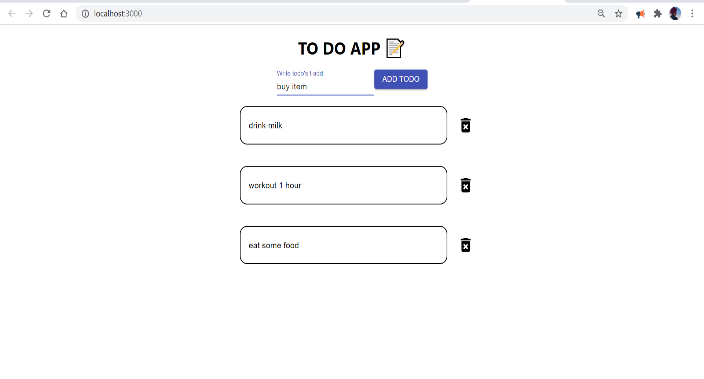

# TODO React app

This is a sample react todo app made by using React Hooks.


## Instructions

First clone this repository.
```bash
$ git clone https://github.com/kabirbaidhya/react-todo-app.git
```

Install dependencies. Make sure you already have [`nodejs`](https://nodejs.org/en/) & [`npm`](https://www.npmjs.com/) installed in your system.
```bash
$ npm install # or yarn
```

Run it
```bash
$ npm start # or yarn start
```

Runs the app in the development mode.\
Open [http://localhost:3000](http://localhost:3000) to view it in the browser.

The page will reload if you make edits.\
You will also see any lint errors in the console.

### Here is the demo image

